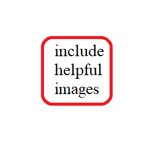

# Project Title

Project statement should be here.


 
## Examples

put 2-3 small examples here


### Example 1:

**Input:** `nums = [2,7,11,15]`, `target = 9`

**Output:** `[0,1]`

**Explanation:** Because `nums[0] + nums[1] == 9`, we return `[0, 1]`.

## Constraints

- Constraint 1
- Constraint 2

## Follow-up


### Topics


### Level 


## Code (stub to show parameters, return type, and definitions)

```java
\\ put your Java stub code here
class Solution {
    public int[] twoSum(int[] nums, int target) {
        // code here

    }
}
```

## Test cases

### Test Case 1

`nums = [2,7,11,15]`

`target = 9`
